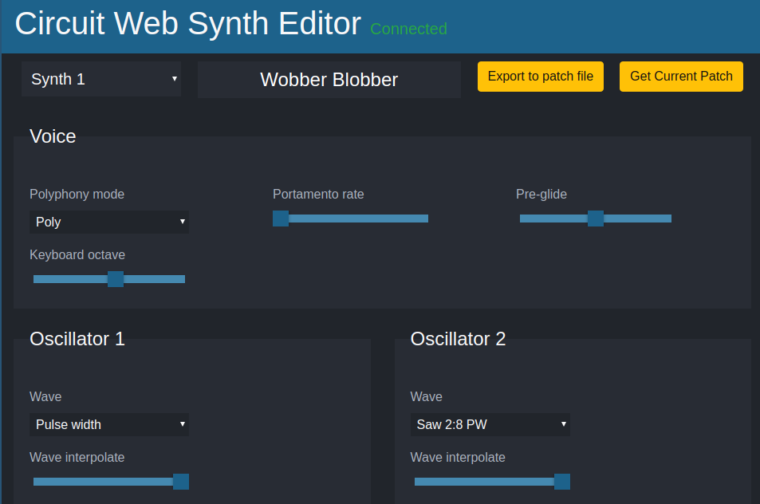
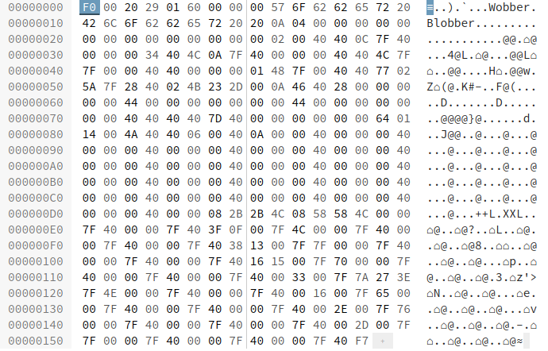

# Circuit Web Synth Editor

Circuit Web Synth Editor is a Free/Libre web application to edit patches on the Novation Circuit.

It works offline but need a browser compatible with WebMidi API.

The purpose of this project is to cover my personnal needs by avoiding the use of other editors not compatible with GNU/Linux.

It can edit an existing patch on the circuit, create new ones and export to Sysex file compatible with Novation Component.

It's a work in progress quickly made.

# License

This application is published under the GPL3 license.

# Terms of use

I can not be held liable for material damage, loss of data or any other inconvenience resulting from the use of this software. **Use it at your own risk**.

# Installation & usage

- Clone this repository or download and extract a zipped release.
- Plug in the Circuit USB.
- Open the html file with one supported browser.
- If the connection is successful, *Connected* appears in green on the screen and a short sound is played by the Circuit.

You always have to connect the Circuit first or must reload the page after the plug in.

# Troubleshootings

If the Circuit freezes for some reason, unplug USB wire.

[You can report any problems](https://framagit.org/pumpkin/circuit-web-synth-editor/issues).

# Libraries

Circuit Web Synth Editor uses:

- Bootstrap 4.0.0-beta and its dependencies (jquery, popper).
- FileSaver.js
- WebMidi.js

# TODO

- Display values on sliders

- Support of multiple macro parameters
- Support of ModMatrix

- Code refactoring

- Better UI

# Documentation

## Patch file

Patch file example:

### BOF and EOF

| Position      | Type of data  | Values |
| ------------- | ------------- | ------ |
| 0x00000000    | BOF char      | F0     |
| 0x0000015D    | EOF char      | F7     |

### Metadata

| Position                 | Type of data            | Values                     |
| ------------------------ | ----------------------- | -------------------------- |
| 0x00000001 to 0x00000003 | Manufacturer code       | 00 20 29                   |
| 0x00000004 to 0x00000005 | ? Type of sysex (patch) | 01 60                      |
| 0x00000006               | unknown                 | 00                         |
| 0x00000007               | unknown                 | 00                         |
| 0x00000008               | unknown                 | 00                         |
| 0x00000009 to 0x00000018 | Patch name (16 chars)   | Chars encoded              |
| 0x00000019               | Music category          | Classic, drum, poly ...    |
| 0x0000001A               | Music genre             | Techno, house, classic ... |
| 0x0000001B to 0x00000028 | unknown                 | 00                         |

### Synth data

| Position                 | Type of data   | Values                             |
| ------------------------ | ---------------| ---------------------------------  |
| 0x00000029 to 0x0000015C | Synth's values | [See Novation Circuit PDF](resources/circuit-midi-parameters-v4.pdf) |

The values follow an order quite close to the circuit PDF table.

Look at the html file on order attributes of *input* and *select* to see the order for each values.

There are 308 values for synth's data.

#### LFO

Params values **0:122** and **0:123** are grouped on **0x0000003B** for *LFO1* and **0x00000044** for *LFO2*

Values of **0:122** and **0:123** are added to be stored on these slots.

Here are the mapping:

| LFO | Parameter     | Control # | CC values | Patch values |
| ----| ------------- | --------- | --------- | ------------ |
| 1   | Fade Mode     | 0:123     | 0         | 0            |
| 1   | Fade Mode     | 0:123     | 1         | 16           |
| 1   | Fade Mode     | 0:123     | 2         | 32           |
| 1   | Fade Mode     | 0:123     | 3         | 48           |
| 1   | One shot      | 0:122     | 12        | 0            |
| 1   | One shot      | 0:122     | 13        | 1            |
| 1   | Key sync      | 0:122     | 14        | 0            |
| 1   | Key sync      | 0:122     | 15        | 2            |
| 1   | Common sync   | 0:122     | 16        | 0            |
| 1   | Common sync   | 0:122     | 17        | 4            |
| 1   | Delay trigger | 0:122     | 18        | 0            |
| 1   | Delay trigger | 0:122     | 19        | 8            |

| LFO | Parameter     | Control # | CC values | Patch values |
| ----| ------------- | --------- | --------- | ------------ |
| 2   | Fade Mode     | 0:123     | 4         | 0            |
| 2   | Fade Mode     | 0:123     | 5         | 16           |
| 2   | Fade Mode     | 0:123     | 6         | 32           |
| 2   | Fade Mode     | 0:123     | 7         | 48           |
| 2   | One shot      | 0:122     | 22        | 0            |
| 2   | One shot      | 0:122     | 23        | 1            |
| 2   | Key sync      | 0:122     | 24        | 0            |
| 2   | Key sync      | 0:122     | 25        | 2            |
| 2   | Common sync   | 0:122     | 26        | 0            |
| 2   | Common sync   | 0:122     | 27        | 4            |
| 2   | Delay trigger | 0:122     | 28        | 0            |
| 2   | Delay trigger | 0:122     | 29        | 8            |

So for example:

- If **0x0000003B** value is decimal **51** (Patch values 48 + 2 + 1) the following CC values are selected:

  Fade Mode 3 / Key sync 15 / One shot 13.

  The others CC values are 0.

- If **0x00000044** value is decimal **42** (Patch values 32 + 8 + 2) the following CC values are selected:

  Fade Mode 6 / Delay trigger 29 / Key sync 25.

  The others CC values are 0.

## Request data of current selected patch on Circuit

midi-out:

| Position   |     |   |    |    |   |    |    |   |   |     |
| ---------- | --- | - | -- | -- | - | -- | -- | - | - | --- |
| 0x00000000 | 240 | 0 | 32 | 41 | 1 | 96 | 64 | 0 | 0 | 247 |

midi-in:

Patch data as described into the patch file part.

## Store patch data on Circuit

midi-out:

| Position   |     |   |    |    |   |    |   |    |   |     |
| ---------- | --- | - | -- | -- | - | -- | - | -- | - | --- |
| 0x00000000 | 240 | 0 | 32 | 41 | 1 | 96 | 1 | 32 | 0 | ... |

- At **0x00000007** is the index position of the slot (32 in this case) where the patch has to be stored. Decimal values allowed are 0 to 63.

- From **0x00000009** to end is the rest of the metadata and data sequence as described in the patch file part (see above).

## Initialize new buffered patch

midi-out:

| Position   |     |   |    |    |   |    |   |   |   |     |
| ---------- | --- | - | -- | -- | - | -- | - | - | - | --- |
| 0x00000000 | 240 | 0 | 32 | 41 | 1 | 96 | 0 | 0 | 0 | ... |

- From **0x00000009** to end is the rest of the metadata and data sequence as described in the patch file part (see above).

